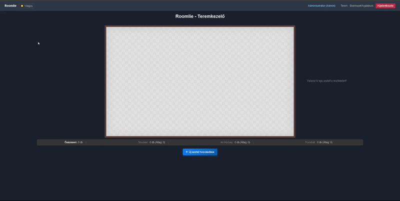

# Roomlie - Interactive Venue Management System 🎱


Roomlie is a comprehensive, frontend-heavy web application designed for managing game rooms, pub tables, or event spaces. It features a fully interactive 2D floor plan editor, a role-based booking system, and dark mode support.

> **Note for Recruiters:** The backend server for this university project was deprecated. To keep the project fully reviewable and functional in a portfolio context, I implemented a **Graceful Degradation (Mock API)** system. The app automatically intercepts HTTP requests and serves realistic mock data via browser `localStorage`, simulating database persistence and network latency.

---

## 📸 Sneak Peek


---

## 💡 Key Engineering Highlights

This project was built to demonstrate problem-solving without over-relying on heavy third-party libraries:

*   **Custom 2D Physics & Spatial Awareness:** Instead of using heavy libraries like `react-rnd`, I implemented a custom drag-and-drop hook (`useTablePhysics`). It handles boundary collision, physical overlap prevention (bounding box checks), and calculates dynamic "buffer zones" around tables.
*   **Mobile-First Touch Support:** Handled cross-device compatibility by mapping both `MouseEvent` and `TouchEvent` listeners, implementing `touch-action: none` to prevent screen-scrolling interference during item manipulation on mobile devices.
*   **Graceful Degradation (Local-first DB):** Built a custom `apiClient` wrapper. Without an active backend, it acts as a mini REST server in the browser, handling authentication, CRUD operations, and relational data (tables ↔ bookings) directly in `localStorage`.
*   **Clean Architecture:** Separated complex mathematical logic into custom hooks, keeping React components strictly focused on UI rendering.

## 🚀 Features

**Admin Capabilities:**
*   **Visual Floor Editor:** Drag, drop, and position items (Foosball, Snooker, Air-hockey tables) in a dynamic 2D space.
*   **Conflict Prevention:** The UI turns red and prevents dropping if an item overlaps with another table or its required player-buffer zone.
*   **Booking Management:** Accept or decline incoming reservations.

**User Capabilities:**
*   Browse the real-time layout of the room.
*   Check available timeslots for specific tables.
*   Submit reservations and track their status.
*   Dark/Light theme toggle.

## 🛠️ Tech Stack

*   **Frontend:** React 19, TypeScript, Vite
*   **State Management:** Redux Toolkit (Authentication & User Sessions)
*   **Styling:** CSS3 (Variables, Responsive Grid/Flexbox, Dark Mode architecture)
*   **Data Persistence:** Simulated API using `localStorage` wrapper

## 💻 Running Locally

To run this project on your local machine:

1. Clone the repository:
   ```bash
     git clone [https://github.com/Varoczi/React_beadando_v2.git](https://github.com/Varoczi/React_beadando_v2.git)
   ```
   
2. Navigate to the directory:
  ```bash
    cd React_beadando_v2
  ```

3. Install dependencies:

  ```bash
    npm install
  ```

4. Start the development server:

  ```bash
    npm run dev
  ```

## 🔐 Demo Accounts

*   Since the application uses a simulated backend, you can test both roles using these credentials, or register a new user:
*   Admin: admin@example.com | Password: admin123
*   User: Register any new account through the UI.
